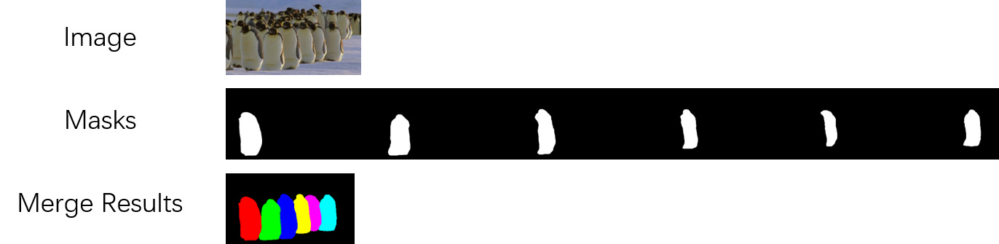

# Preprocessing SegTrack v2

### Download raw images and ground-truth

Download SegTrack v2 [here](https://web.engr.oregonstate.edu/~lif/SegTrack2/SegTrackv2.zip).

### Make the `Annotations` file

Merge the objects in a single image, like following. Also, transform `*.bmp` into `*.png` in `JPEGImages`. 



```
python process_data.py
```

### Label `meta.json` manually

````json
{
    "videos": {
        "bird_of_paradise": {
            "objects": {
                "1": {
                    "category": "bird", 
                    "frames": [
                        "00000",
                        ..., 
                        "00001"
                    ]
                }
            }
        }
    }
}
````

### Crop & Generate data info

````shell
# generate `instance_train.json` and `instances_val.json`
python parse_segtrack_vos.py

# crop masks and images
# python par_crop.py [crop_size] [num_threads]
python par_crop.py 511 12
# generate `train.json`
python gen_json.py
````

### Final format

```
|_Annotations
|  |_bird_of_paradise
|  |_...
|  |_worm
|_Code
|_crop511
|  |_bird_of_paradise
|  |_...
|  |_worm
|_GroundTruth
|_ImageSets
|_JPEGImages
|  |_bird_of_paradise
|  |_...
|  |_worm
|_meta.json
|_instances_train.json
|_instances_val.json
|_train.json

```

